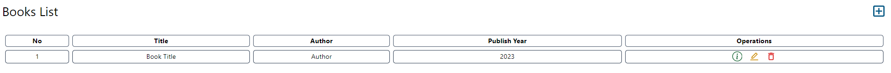
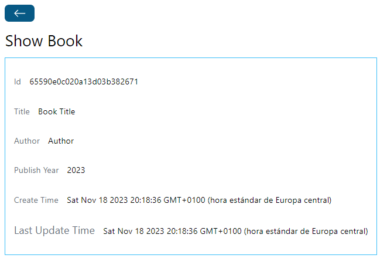
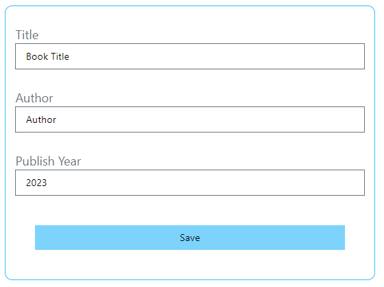
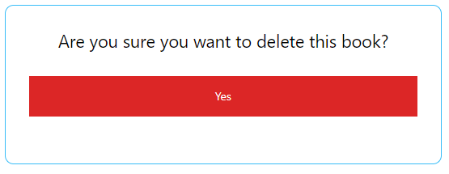
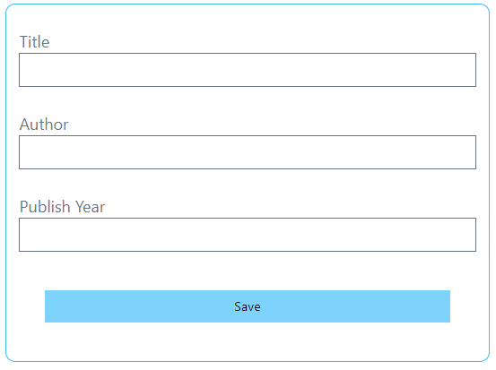

# Book Store Web App 📖

This Web Application allows the user to add information about his/her favourite books, personally it was an excuse to start developing using the **MERN** tech stack.

## Technologies used
  ### Backend
  + Node JS
  + Express JS
  + MongoDB
  ### Frontend
  + Node JS
  + React
  + TailWind CSS

## How does it work
It has various functionalities, like -->

### Display the books of a database in a table

### Read information about a book

### Edit information about a book

### Delete a book

### Create a book

